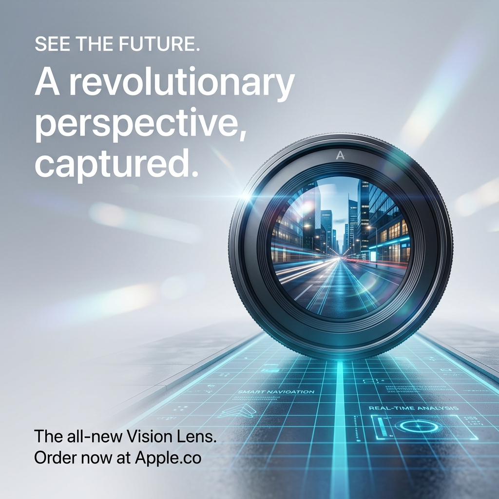
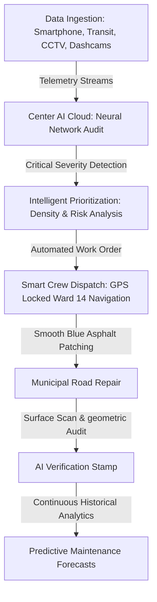
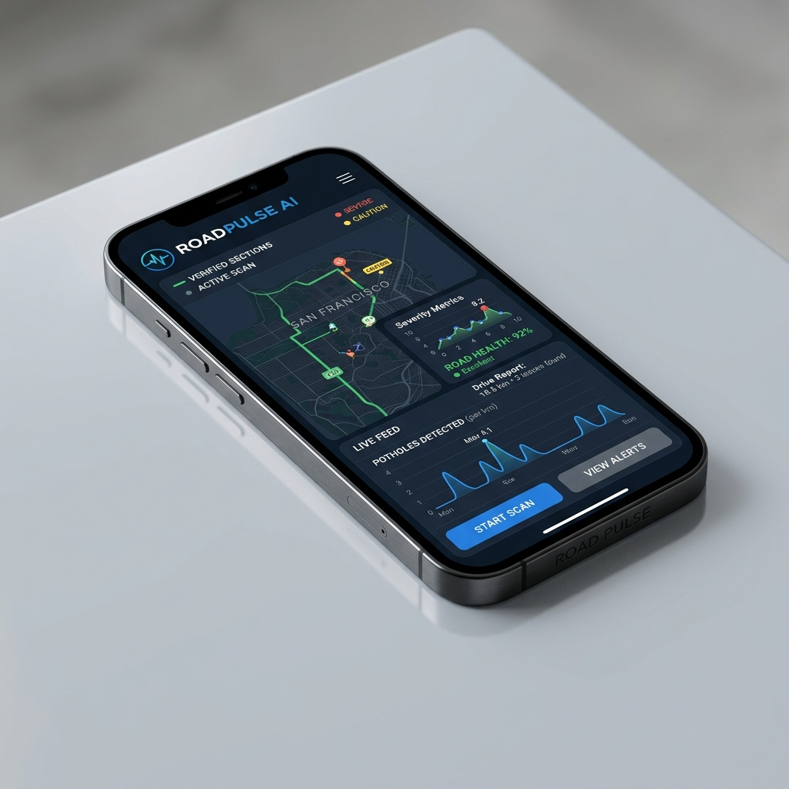

# RoadPulse AI — Intelligent Civic Infrastructure

<p align="center">
  
</p>

---

## ✦ The Vision: Invisible Intelligence

RoadPulse AI is a premium, AI-powered civic infrastructure platform designed to make roads intelligent and protect millions of lives daily. Rather than a simple citizen-reporting app, RoadPulse AI silently monitors and safeguards cities by establishing a passive, continuous auditing network over urban asphalt.

In countries like India, road fractures, structural decay, and potholes pose critical safety challenges. RoadPulse AI converts crowdsourced, everyday vehicle journeys and municipal feeds into real-time telemetry data—enabling cities to detect structural vulnerabilities before they trigger severe accidents.

---

## ✦ Immersive System Architecture: "The Living City"

The platform operates as a closed-loop storytelling system that spans ingestion, analysis, crew dispatch, and mathematical verification:



### 1. Ingestion (Data Sources)
RoadPulse AI taps into existing transit infrastructure without requiring custom telemetry hardware:
* **📱 Smartphone Sensors**: Passive vibration and optical monitoring from dash-mounted devices.
* **🚌 Transit Buses**: Real-time city-wide coverage via municipal transit routes.
* **📷 CCTV Networks**: Video stream ingestion from traffic junction checkpoints.
* **🚗 Dashcam Feeds**: High-resolution optical audits from passenger vehicle cameras.

### 2. Neural Cloud & Prioritization
Raw telemetry flows up into the **Center AI Cloud**. When damage is detected, the system immediately calculates a **Priority Index** based on:
$$\text{Priority Score} = f(\text{Severity}, \text{Traffic Density}, \text{Road Classification})$$
This ensures repair crews focus on high-impact routes (such as major arteries or high-speed expressways) rather than residential side streets.

### 3. Automated Work Order & SMS Dispatch
The AI system automates administrative routing, sending an instant SMS alert to the closest municipal maintenance unit, locked to the exact GPS node with turn-by-turn navigation and material lists.

### 4. Mathematical Verification
Once the repair is completed, the system scans the surface again to verify compliance across three vectors:
1. **✓ Surface Level**: Confirming zero elevation variance.
2. **✓ Material Quality**: Auditing structural density signatures.
3. **✓ Geometric Audit**: Verifying slope profiles to prevent pooling.

---

## ✦ The Interface

<p align="center">
  
</p>

*The user dashboard provides city planners with a minimalist, high-fidelity view of active repairs, vehicle dispatches, and predictive decay indexes mapped over weather trends.*

---

## ✦ Technology Stack

RoadPulse AI is built using modern, highly optimized technologies for visual rendering and HMR speed:

* **Frontend Framework**: [React](https://react.dev/) + [Vite](https://vite.dev/) (Client compilation in under 900ms)
* **Animations**: [Framer Motion](https://www.framer.com/motion/) (Hardware-accelerated viewport layouts)
* **Styling**: Vanilla CSS (Tailored HSL design tokens, blueprint grid patterns, glassmorphism overlays)
* **Icons**: [Lucide React](https://lucide.dev/) (Outlined, thin, Apple-style iconography)

---

## ✦ Local Development & Installation

To run RoadPulse AI locally, make sure you have [Node.js](https://nodejs.org/) installed:

### 1. Clone & Install Dependencies
```bash
git clone https://github.com/anishedu2234-coder/roapai.git
cd roapai
npm install
```

### 2. Start Development Server
```bash
npm run dev
```
Open [http://localhost:5173](http://localhost:5173) in your browser to view the interactive city illustration.

### 3. Compile for Production
```bash
npm run build
```
This generates the optimized, static production bundle inside the `/dist` directory.
